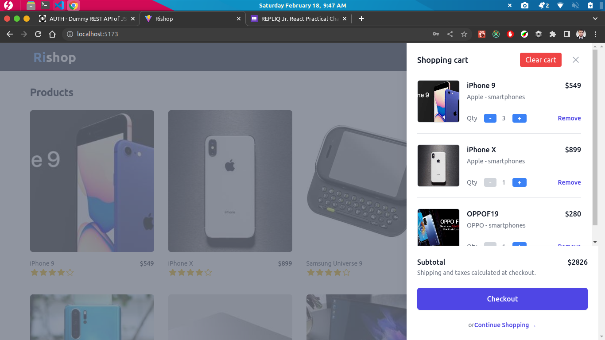
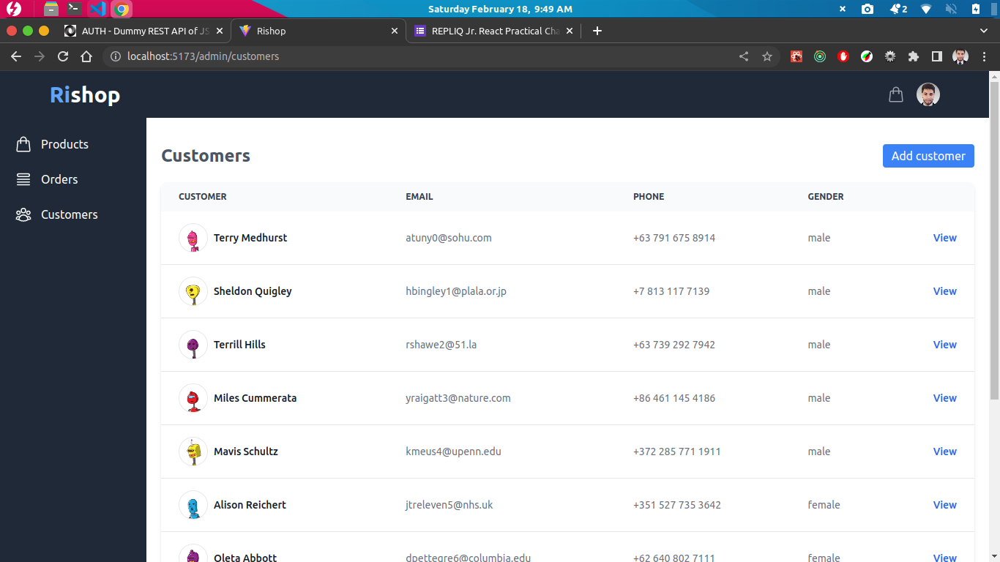

# Rishop

Rishop is a simple e-commerce web application (client-side and admin dashboard).

> Products, Orders and Customers data are fetched from [DummyJSON](https://dummyjson.com).

**[Live Preview](https://rishop.vercel.app)**

## Authentication:

I've made a simple custom authentication system using localStorage.

> _I have added an admin and a non-admin user account to help on your testing_

**Credentials**:

- Admin account: `phone: 01784254902, password: pass1234`
- Non-admin account: `phone: 01614729335, password: pass1234`

**Authentication features:**

- Register and sign-in
- User can't add to cart or buy products without an account
- Role based authorization
- Normal user can't access admin dashboard

**Authentication process**:

Initially I've create a users list and storing it to the localStorage to test the application (An Admin and a normal user).
However if users list is already exists in localstorage I am skipping this step.

The authentication process is pretty simple:

- Read users list from localStorage
- Check if user exists or not with given credentials
- Compare user's credentials with given credentials
- If credentials matches let the user log in to the site, else show an exception

The registration process is also very simple:

- Read users list from localStorage
- Check if user already exists or not with given credentials
- If user dosen't already exist, create user with given credentials
- Add newly create user to the user's list and resave users list in localStorage

## Project navigation

> **Note:** Application flow is working fine and its user-friendly. This section is added to help on additional testing.

**Auth**:

- `/register`: Register form
- `/login`: Login form

**Client**:

- `/*`: Client-side routes (fully navigateable)
- `/`: Homepage
- `/checkout`: Checkout page
- `/order-placed`: Order placed page

**Admin**:

- `/admin/*`: Admin dashboard routes (fully navigateable)
- `/admin`: Admin dashboard home
- `/admin/products`: Product's table
- `/admin/products/:productId`: Product detail
- `/admin/products/add`: Add product form
- `/admin/orders`: Order's table
- `/admin/orders/:orderId`: Order detail
- `/admin/customers`: Customer's table
- `/admin/customer/:customerId`: Customer detail
- `/admin/customer/add`: Add customer form

## Dependencies and technologies

```JSON
 "dependencies": {
    "@headlessui/react": "^1.7.11",
    "@heroicons/react": "^2.0.15",
    "@reduxjs/toolkit": "^1.9.2",
    "axios": "^1.3.3",
    "react": "^18.2.0",
    "react-dom": "^18.2.0",
    "react-redux": "^8.0.5",
    "react-router-dom": "^6.8.1",
    "react-spinners": "^0.13.8",
    "react-toastify": "^9.1.1"
  },
  "devDependencies": {
    "@tailwindcss/aspect-ratio": "^0.4.2",
    "@tailwindcss/forms": "^0.5.3",
    "@types/react": "^18.0.27",
    "@types/react-dom": "^18.0.10",
    "@vitejs/plugin-react": "^3.1.0",
    "autoprefixer": "^10.4.13",
    "eslint": "^8.34.0",
    "eslint-config-react-app": "^7.0.1",
    "postcss": "^8.4.21",
    "tailwindcss": "^3.2.6",
    "vite": "^4.1.0"
  }
```

## Project screenshots

### Register


### Login


### Home / products


### Product detail


### Cart



### Checkout


### Order placed


### Admin: products


### Admin: order detail


### Admin: customers



### Admin: customer detail


## Project structure

```.
├── index.html
├── ls.txt
├── package.json
├── postcss.config.cjs
├── public
│   ├── images
│   │   └── rifatptk.png
│   ├── screenshots
│   │   ├── cart.png
│   │   ├── checkout.png
│   │   ├── customers.png
│   │   ├── home.png
│   │   ├── product-detail.png
│   │   ├── register.png
│   │   └── signin.png
│   └── vite.svg
├── README.md
├── src
│   ├── apiConfigs
│   │   └── axiosInstances.js
│   ├── App.jsx
│   ├── assets
│   │   └── react.svg
│   ├── components
│   │   ├── admin
│   │   │   ├── CustomersTable.jsx
│   │   │   ├── Order.jsx
│   │   │   ├── OrdersTable.jsx
│   │   │   ├── ProductsTable.jsx
│   │   │   └── Profile.jsx
│   │   ├── cart
│   │   │   └── ShoppingCart.jsx
│   │   ├── common
│   │   │   ├── Footer.jsx
│   │   │   ├── Navbar.jsx
│   │   │   └── Sidebar.jsx
│   │   ├── Home
│   │   │   ├── ProductCard.jsx
│   │   │   └── ProductList.jsx
│   │   └── productDetail
│   │       ├── ProductOverview.jsx
│   │       └── RiSlider.jsx
│   ├── hooks
│   │   └── useGetData.js
│   ├── index.css
│   ├── layouts
│   │   ├── AdminLayout.jsx
│   │   └── ClientLayout.jsx
│   ├── main.jsx
│   ├── pages
│   │   ├── admin
│   │   │   ├── CustomerDetail.jsx
│   │   │   ├── Customers.jsx
│   │   │   ├── OrderDetail.jsx
│   │   │   ├── Orders.jsx
│   │   │   ├── Products.jsx
│   │   │   └── SingleProduct.jsx
│   │   └── client
│   │       ├── Checkout.jsx
│   │       ├── Home.jsx
│   │       ├── Login.jsx
│   │       ├── NotFound.jsx
│   │       ├── OrderPlaced.jsx
│   │       ├── ProductDetail.jsx
│   │       └── Register.jsx
│   ├── redux
│   │   ├── features
│   │   │   ├── auth
│   │   │   │   └── authSlice.js
│   │   │   ├── cart
│   │   │   │   └── cartSlice.js
│   │   │   └── checkout
│   │   │       └── checkoutSlice.js
│   │   ├── store.js
│   │   └── storeWithMiddleware.js
│   └── routes
│       ├── AdminRouter.jsx
│       ├── ClientRouter.jsx
│       └── Router.jsx
├── tailwind.config.cjs
├── vercel.json
├── vite.config.js
└── yarn.lock

23 directories, 60 files
```

# Getting Started

This project was bootstrapped with `Vite`

## Available Scripts

In the project directory, you can run:

### `yarn`

Installs project dependencies.

### `yarn dev`

Runs the app in the development mode.\
Open [http://localhost:5173](http://localhost:5173) to view it in your browser.

The page will reload when you make changes.\
You may also see any lint errors in the console.

### `yarn build`

Builds the app for production to the `dist` folder.\
It correctly bundles React in production mode and optimizes the build for the best performance.

The build is minified and the filenames include the hashes.\
Your app is ready to be deployed!
