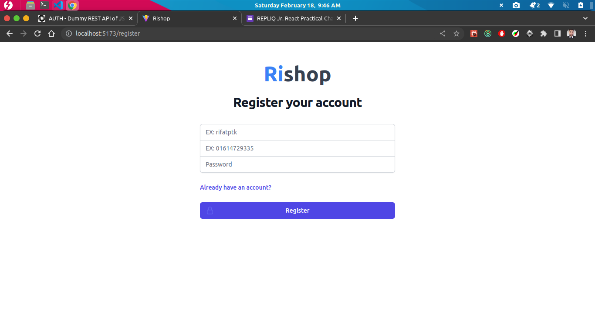
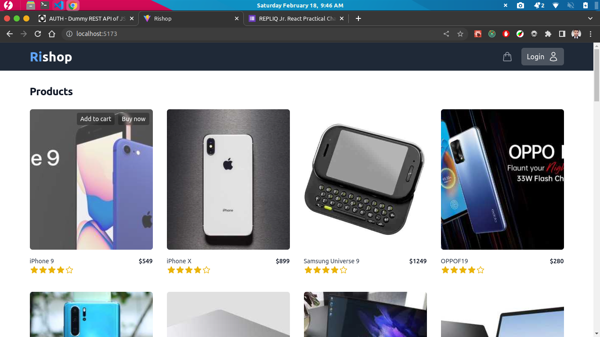
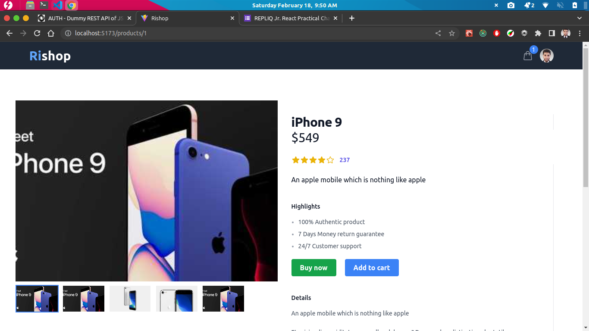

# Rishop

Rishop is a simple e-commerce web application (client side and admin dashboard).

## Dependencies and technologies

```JSON
 "dependencies": {
    "@headlessui/react": "^1.7.11",
    "@heroicons/react": "^2.0.15",
    "@reduxjs/toolkit": "^1.9.2",
    "axios": "^1.3.3",
    "react": "^18.2.0",
    "react-dom": "^18.2.0",
    "react-redux": "^8.0.5",
    "react-router-dom": "^6.8.1",
    "react-spinners": "^0.13.8",
    "react-toastify": "^9.1.1"
  },
  "devDependencies": {
    "@tailwindcss/aspect-ratio": "^0.4.2",
    "@tailwindcss/forms": "^0.5.3",
    "@types/react": "^18.0.27",
    "@types/react-dom": "^18.0.10",
    "@vitejs/plugin-react": "^3.1.0",
    "autoprefixer": "^10.4.13",
    "eslint": "^8.34.0",
    "eslint-config-react-app": "^7.0.1",
    "postcss": "^8.4.21",
    "tailwindcss": "^3.2.6",
    "vite": "^4.1.0"
  }
```

## Project navigation

> **Note:** Application flow is working fine and its user-friendly. This section is added to help on additional testing.

**Client**:

- `/*`: Client-side routes (fully navigateable)
- `/`: Homepage
- `/register`: Register form
- `/login`: Login form
- `/checkout`: Checkout page
- `/order-placed`: Order placed page

**Admin**:

- `/admin/*`: Admin dashboard routes (fully navigateable)
- `/admin`: Admin dashboard home
- `/admin/products`: Product's table
- `/admin/products/:productId`: Product detail
- `/admin/orders`: Order's table
- `/admin/orders/:orderId`: Order detail
- `/admin/customers`: Customer's table
- `/admin/customer/:customerId`: Customer detail

## Project screenshots

### Register



### Sign-in


### Home / products



### Product detail



### Cart


### Checkout


### Admin: customers


## Project structure

```.
├── index.html
├── ls.txt
├── package.json
├── postcss.config.cjs
├── public
│   ├── images
│   │   └── rifatptk.png
│   ├── screenshots
│   │   ├── cart.png
│   │   ├── checkout.png
│   │   ├── customers.png
│   │   ├── home.png
│   │   ├── product-detail.png
│   │   ├── register.png
│   │   └── signin.png
│   └── vite.svg
├── README.md
├── src
│   ├── apiConfigs
│   │   └── axiosInstances.js
│   ├── App.jsx
│   ├── assets
│   │   └── react.svg
│   ├── components
│   │   ├── admin
│   │   │   ├── CustomersTable.jsx
│   │   │   ├── Order.jsx
│   │   │   ├── OrdersTable.jsx
│   │   │   ├── ProductsTable.jsx
│   │   │   └── Profile.jsx
│   │   ├── cart
│   │   │   └── ShoppingCart.jsx
│   │   ├── common
│   │   │   ├── Footer.jsx
│   │   │   ├── Navbar.jsx
│   │   │   └── Sidebar.jsx
│   │   ├── Home
│   │   │   ├── ProductCard.jsx
│   │   │   └── ProductList.jsx
│   │   └── productDetail
│   │       ├── ProductOverview.jsx
│   │       └── RiSlider.jsx
│   ├── hooks
│   │   └── useGetData.js
│   ├── index.css
│   ├── layouts
│   │   ├── AdminLayout.jsx
│   │   └── ClientLayout.jsx
│   ├── main.jsx
│   ├── pages
│   │   ├── admin
│   │   │   ├── CustomerDetail.jsx
│   │   │   ├── Customers.jsx
│   │   │   ├── OrderDetail.jsx
│   │   │   ├── Orders.jsx
│   │   │   ├── Products.jsx
│   │   │   └── SingleProduct.jsx
│   │   └── client
│   │       ├── Checkout.jsx
│   │       ├── Home.jsx
│   │       ├── Login.jsx
│   │       ├── NotFound.jsx
│   │       ├── OrderPlaced.jsx
│   │       ├── ProductDetail.jsx
│   │       └── Register.jsx
│   ├── redux
│   │   ├── features
│   │   │   ├── auth
│   │   │   │   └── authSlice.js
│   │   │   ├── cart
│   │   │   │   └── cartSlice.js
│   │   │   └── checkout
│   │   │       └── checkoutSlice.js
│   │   ├── store.js
│   │   └── storeWithMiddleware.js
│   └── routes
│       ├── AdminRouter.jsx
│       ├── ClientRouter.jsx
│       └── Router.jsx
├── tailwind.config.cjs
├── vercel.json
├── vite.config.js
└── yarn.lock

23 directories, 60 files
```

# Getting Started

This project was bootstrapped with `Vite`

## Available Scripts

In the project directory, you can run:

### `yarn`

Installs project dependencies.

### `yarn dev`

Runs the app in the development mode.\
Open [http://localhost:5173](http://localhost:5173) to view it in your browser.

The page will reload when you make changes.\
You may also see any lint errors in the console.

### `yarn build`

Builds the app for production to the `dist` folder.\
It correctly bundles React in production mode and optimizes the build for the best performance.

The build is minified and the filenames include the hashes.\
Your app is ready to be deployed!
